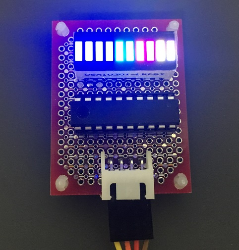
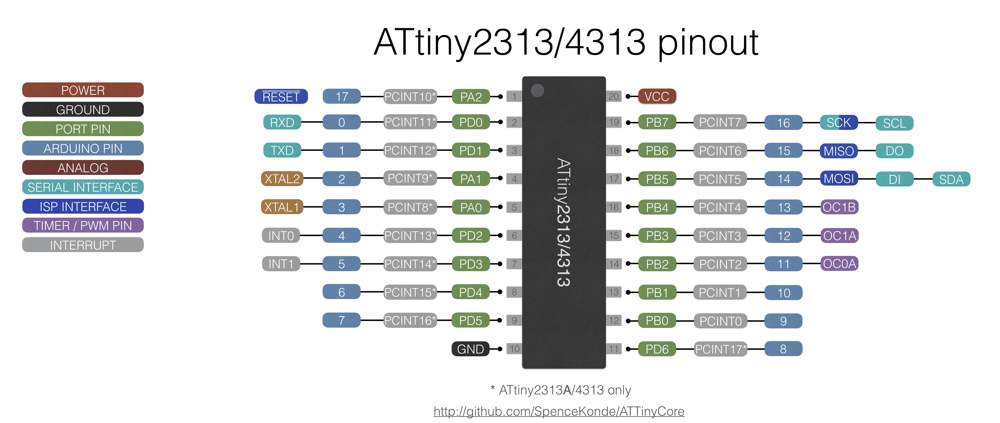
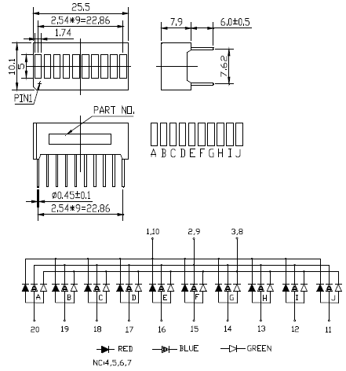

10seg color LED (OSX10201-LRPB2) I2C driver using attiny2313
====

## Description
A program 10seg color LED (OSX10201-LRPB2) I2C driver using attiny2313.  
(Atmel Studio 7 project files)  

By using the I2C command, you can easily turn on and off any LED with any color.  
Details of the I2C command can be found in the following PDF.  

[10segcolorled_i2c_attiny2313.pdf](./docs/10segcolorled_i2c_attiny2313.pdf)  

## Notice

The operation of this program has been confirmed using the i2cget / i2cset command of Raspberry Pi 3.  
In some cases, commands may not be received.  

As described in the AVR312 document, the I2C library ignores the stop condition,   
so it depends on the timing of command analysis of the buffer passed to the upper layer.  
Due to the simplicity of the command system, malfunctions may occur depending on the timing of command reception. 

In the case of the arduino Wire library for the I2C master, I2C reception errors could hardly be confirmed.  
However, it was confirmed that I2C bus lock occurred by issuing consecutive commands.  
It is recommended to delay about 10ms after sending one command.  


## Demo Circut



```
    ATtiny2313 fuse factory default LOW:0x64 HIGH:0xDF EXT:0xFF LOCK:0xFF
    I2C Address:
      d0:NC d1:NC  0x55 (default)
      d0:L  d1:NC  0x56
      d0:NC d1:L   0x57
      d0:L  d1:L   0x58

    port mapping [ATtiny2313]

    bit      7    6    5    4    3    2    1    0
    PORTA    -    -    -    -    -    -   d1   d0
    PORTB    -    r    -    b    g    J    I    H
    PORTD    -    G    F    E    D    C    B    A

    10seg fullcolor [OSX10201-LRPB2]

    ABCDEFJHIJ (VCC)
    rbg----gbr (GND) -> The side where the string is printed

    r - 150R - GND
    b - 100R - GND
    g - 100R - GND

    d0 - sw - GND
    d1 - sw - GND
```


## PinOut

ATtiny2313 pinout  



OSX10201-LRPB2 pinout  




## Reference

* [usiTwiSlave.zip](http://jsdiy.webcrow.jp/usitwis_clcd/) by [@jsdiy]
* [AN_2560 AVR312: Using the USI Module as a I2C Slave](https://www.microchip.com/wwwAppNotes/AppNotes.aspx?appnote=en591197)
* [OSX10201-LRPB2 DataSheet](./docs/OSX10201-LRPB2.pdf)
* [ATtiny2313 DataSheet](./docs/attiny2313.pdf)

## Licence

* [rimksky][] CreativeCommon BY 4.0
* usiTwiSlave.c / usiTwiSlave.h  
  created by [atmel.com]  
  modifyed by [@jsdiy]  
  modified by [rimksky]  

## Author

* [rimksky][]

[rimksky]: https://github.com/rimksky "rimksky"
[@jsdiy]: http://jsdiy.webcrow.jp/ "@jsdiy"
[atmel.com]: https://www.microchip.com/ "atmel.com"
